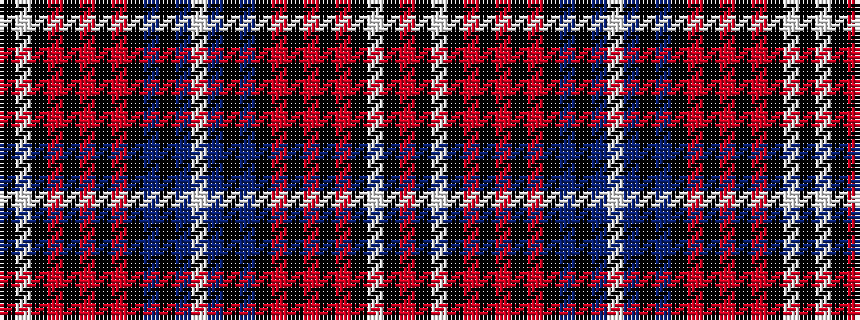

KWKRKRKRKBKBWBKBKRKRKRKWKR

It is a 26 stripe tartan.

<figure class="pat-woven">

<figcaption>idealised sample</figcaption>
</figure>

## Colour Sequence



## Tartans with this colour sequence

| Tartans |
|---------------|
| [Harris (1997) (Personal)](/variants/s26/w6db4k6db30k10r4k3r4k3r18k1w4k1r4~x2/)|
||
