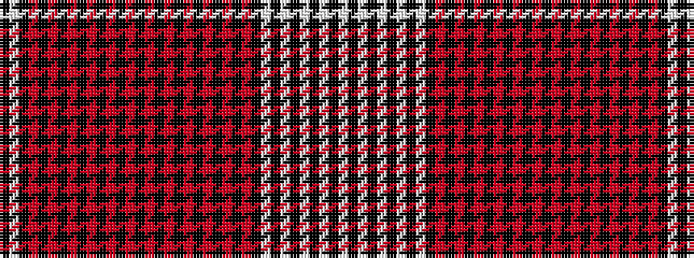

KWKRKRKRKRKRKRKRKRKRKRKRKRKWKWKWKWKW

It is a 36 stripe tartan.

<figure class="pat-woven">

<figcaption>idealised sample</figcaption>
</figure>

## Colour Sequence



## Tartans with this colour sequence

| Tartans |
|---------------|
| [Dunbar Plaid](/setts/s36/w24k4w4k4w4k20w8k20w16k16r1k1r1k1r1k1r1k1r1k1r1k1r1k1r1k1r1k1r1k1r1k1r1k16w96k16~x2/)|
||
