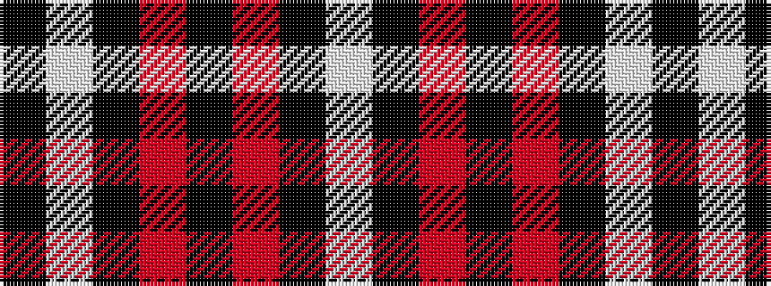

KWKRKRKW

It is a 8 stripe tartan.

<figure class="pat-woven">

<figcaption>idealised sample</figcaption>
</figure>

## Colour Sequence



## Tartans with this colour sequence

| Tartans |
|---------------|
| [Brockton](/setts/s8/k2w1k2r6k6r3k28w2~x2/)|
||
