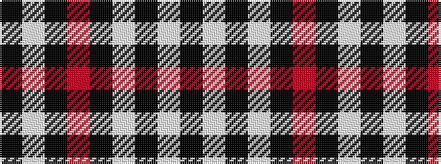

KWKRKWKWK

It is a 9 stripe tartan.

<figure class="pat-woven">

<figcaption>idealised sample</figcaption>
</figure>

## Colour Sequence



## Tartans with this colour sequence

| Tartans |
|---------------|
| [St. Mirren Football Club (Sports)](/setts/s9/k7w2k21r2k34w5k3w2k7~x2/)|
||
