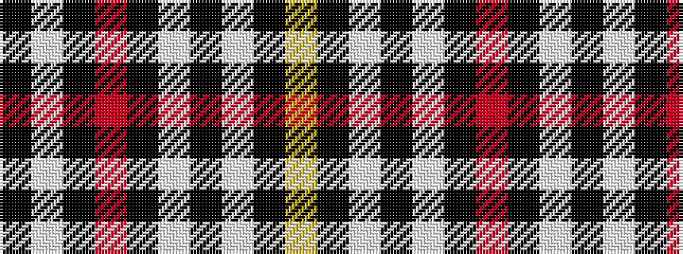

KWKRKWKWKY

It is a 10 stripe tartan.

<figure class="pat-woven">

<figcaption>idealised sample</figcaption>
</figure>

## Colour Sequence



## Tartans with this colour sequence

| Tartans |
|---------------|
| [Little, Arisaid](/variants/s10/k5w4k4r4k4w7k2w7k8ly1~x4/)|
||
