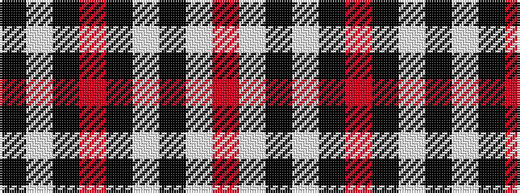

KWKRKWKWR

It is a 9 stripe tartan.

<figure class="pat-woven">

<figcaption>idealised sample</figcaption>
</figure>

## Colour Sequence



## Tartans with this colour sequence

| Tartans |
|---------------|
| [Burberry (Counterfeit #4)](/variants/s9/k10w10k10o32k2w2k2w2r5~x2/)|
||
