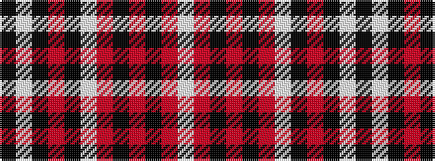

KWKRKWRKRKRW

It is a 12 stripe tartan.

<figure class="pat-woven">

<figcaption>idealised sample</figcaption>
</figure>

## Colour Sequence



## Tartans with this colour sequence

| Tartans |
|---------------|
| [Knights Templar Dress (Corporate)](/variants/s12/k50w4k10r2k2w2r2k14r11k2r4w2~x2/)|
||
