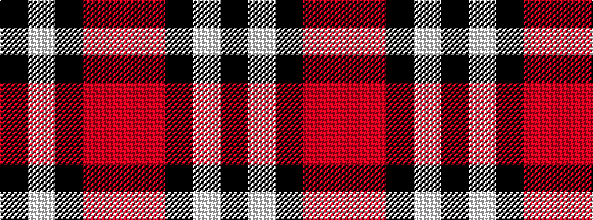

KWKRR

It is a 5 stripe tartan.

<figure class="pat-woven">

<figcaption>idealised sample</figcaption>
</figure>

## Colour Sequence



## Tartans with this colour sequence

| Tartans |
|---------------|
| [Burberry, Check](/variants/s5/k6w6k6o21r2~x4/)|
||
| [Oban Grey (Fashion)](/variants/s5/k4lb4k4o15r2~x4/)|
||
| [Oban Grey District Tartan](/variants/s5/k4w3k4o9r1~x4/)|
||
