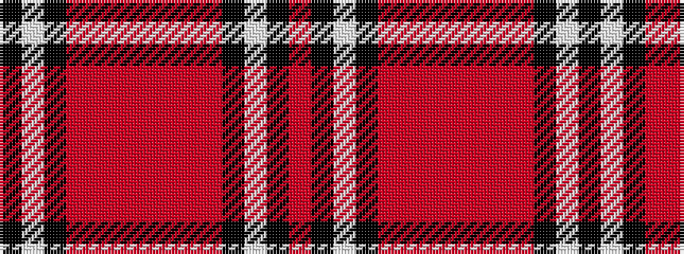

KWKRRRRRRRKWKR

It is a 14 stripe tartan.

<figure class="pat-woven">

<figcaption>idealised sample</figcaption>
</figure>

## Colour Sequence



## Tartans with this colour sequence

| Tartans |
|---------------|
| [Sydney (Nova Scotia)](/variants/s14/r6o1r6o3k2w1k2o6~x4/)|
||
| [Sydney (Nova Scotia) #2](/variants/s14/o16oi2o11oi6k4w2k4oi16~x2/)|
||
