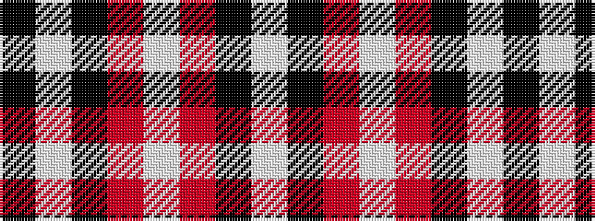

KWKRWRKW

It is a 8 stripe tartan.

<figure class="pat-woven">

<figcaption>idealised sample</figcaption>
</figure>

## Colour Sequence



## Tartans with this colour sequence

| Tartans |
|---------------|
| [Knights Templar Hunting](/variants/s8/k22w1k12r43w1~x2/)|
||
