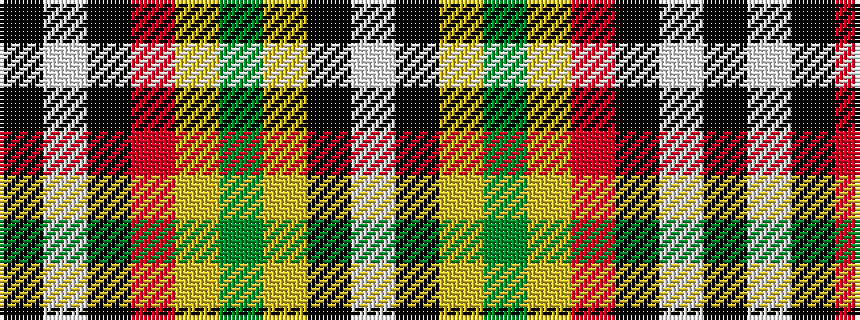

KWKRYGYKW

It is a 9 stripe tartan.

<figure class="pat-woven">

<figcaption>idealised sample</figcaption>
</figure>

## Colour Sequence



## Tartans with this colour sequence

| Tartans |
|---------------|
| [Letter Dress (2014)](/setts/s9/lb29k23lo1dg9lo2r4k14w2k4~x2/)|
||
