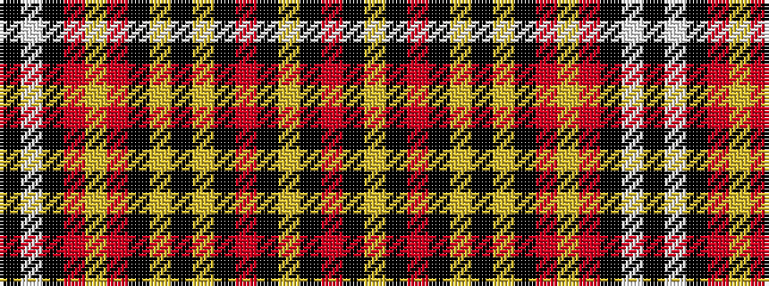

KWKRYRKYKYKRKYKR

It is a 16 stripe tartan.

<figure class="pat-woven">

<figcaption>idealised sample</figcaption>
</figure>

## Colour Sequence



## Tartans with this colour sequence

| Tartans |
|---------------|
| [Maxem Eyewear (Corporate)](/variants/s16/o52k4ly2k8o78k8lr8k4lr4k4o13ly2o4k4w4k4~x4/)|
||
