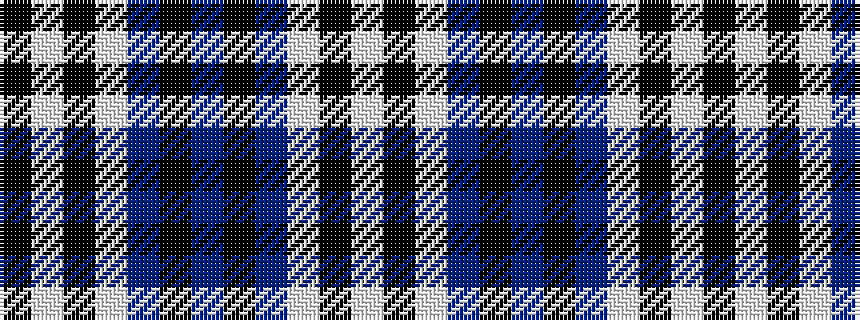

KWKWBKBKBWKW

It is a 12 stripe tartan.

<figure class="pat-woven">

<figcaption>idealised sample</figcaption>
</figure>

## Colour Sequence



## Tartans with this colour sequence

| Tartans |
|---------------|
| [Glasgow Caledonian University (Corp)](/variants/s12/k4w2k25w7t1k5t2k5t1w7k26w2~x2/)|
||
