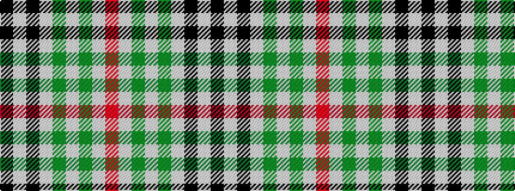

KWKWGWGWR

It is a 9 stripe tartan.

<figure class="pat-woven">

<figcaption>idealised sample</figcaption>
</figure>

## Colour Sequence



## Tartans with this colour sequence

| Tartans |
|---------------|
| [Puffin](/variants/s9/k3w1k1w6g1w1g1w1o3~x4/)|
||
| [Puffin (Personal)](/variants/s9/k4w1k1w9g1w1g1w1o4~x4/)|
||
