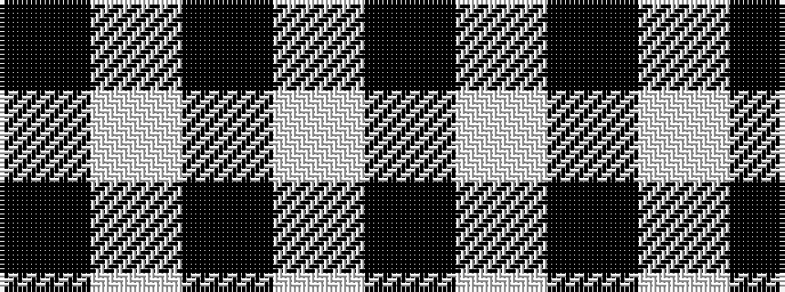

KWKWK

It is a 5 stripe tartan.

<figure class="pat-woven">

<figcaption>idealised sample</figcaption>
</figure>

## Colour Sequence



## Tartans with this colour sequence

| Tartans |
|---------------|
| [Black Camel Tartan Tartan Number: 3333. Earliest known date: Marton Mills Jura./Threadcount and colours aren't 100% original. Generated manually./ See products available Copyright © Blair Urquhart, Comrie, 2015](/setts/s5/k160w6k2w3k3~x2/)|
||
| [Cairn (Marton Mills)](/setts/s5/k2w1k8w8k1~x8/)|
||
| [MacPhee MacFee or MacIver](/setts/s5/k22w3k3w11k1~x2/)|
||
