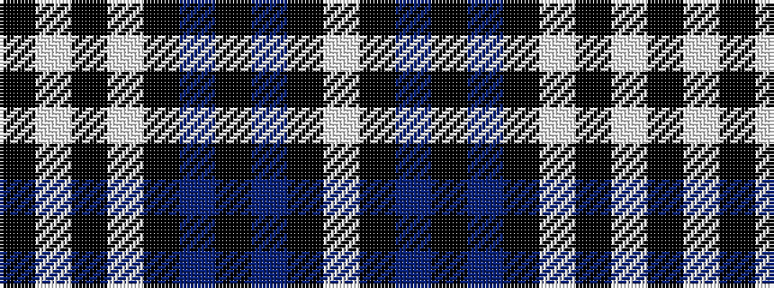

KWKWKBKBKW

It is a 10 stripe tartan.

<figure class="pat-woven">

<figcaption>idealised sample</figcaption>
</figure>

## Colour Sequence



## Tartans with this colour sequence

| Tartans |
|---------------|
| [Seacliff Academy](/setts/s10/k46w1k3lb4k3db3k2db11k1lb2~x2/)|
||
