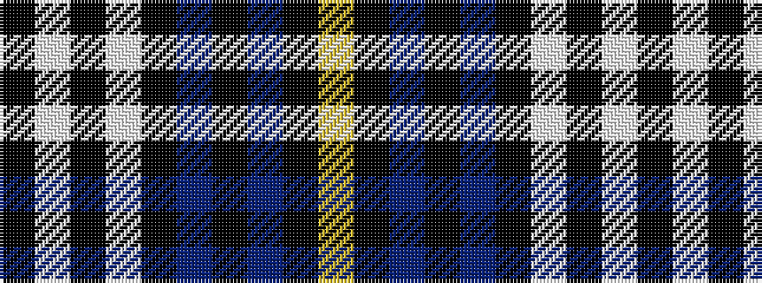

KWKWKBKBKY

It is a 10 stripe tartan.

<figure class="pat-woven">

<figcaption>idealised sample</figcaption>
</figure>

## Colour Sequence



## Tartans with this colour sequence

| Tartans |
|---------------|
| [Little of Morton Rig](/setts/s10/k10w7k8w7k8dr14k4dr14k16ly2/)|
||
| [Little of Morton Rig Family/Clan Tartan Tartan Number: 2349. Earliest known date: 1991 Designed in 1991 by Dr. J.C.(Pat) Little of Morton Rigg, Dumfries, for the newly organized Clan Little Society. Registered with TECA 12 June1992. Incorporates elements of the Wallace and Shepherd setts. from Pat Little via JCT. Sample in STA's Johnston Collection. See products available Copyright © Blair Urquhart, Comrie, 2015](/setts/s10/k4lb4k4lb4k4dr8k2dr8k8lo1~x4/)|
||
