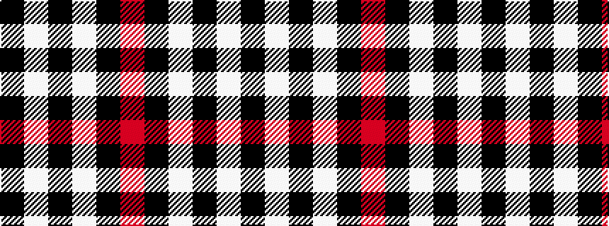

KWKWKR

It is a 6 stripe tartan.

<figure class="pat-woven">

<figcaption>idealised sample</figcaption>
</figure>

## Colour Sequence



## Tartans with this colour sequence

| Tartans |
|---------------|
| [Forget Family (Red)](/variants/s6/r42k2w2k18w2k5~x2/)|
||
| [Machair (warp)](/variants/s6/o72k16w9k4w5k16~x2/)|
||
