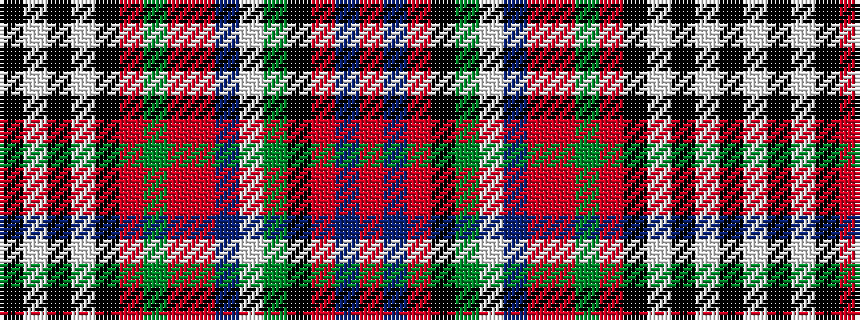

KWKWKRGRRBWGKRBR

It is a 16 stripe tartan.

<figure class="pat-woven">

<figcaption>idealised sample</figcaption>
</figure>

## Colour Sequence



## Tartans with this colour sequence

| Tartans |
|---------------|
| [City of Edinburgh (2001) (District)](/variants/s16/r18t1o18k1g18w1t18r1o18g1r18k3w4k3w4k3~x2/)|
||
