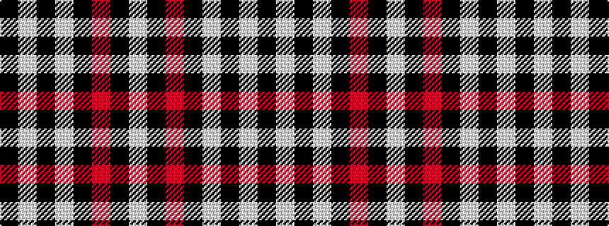

KWKWKRKW

It is a 8 stripe tartan.

<figure class="pat-woven">

<figcaption>idealised sample</figcaption>
</figure>

## Colour Sequence



## Tartans with this colour sequence

| Tartans |
|---------------|
| [Volkswagen Black Trim (Fashion)](/variants/s8/k20w1k1w3k1r1k1w1~x4/)|
||
