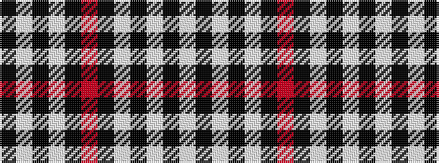

KWKWKRKWKWKW

It is a 12 stripe tartan.

<figure class="pat-woven">

<figcaption>idealised sample</figcaption>
</figure>

## Colour Sequence



## Tartans with this colour sequence

| Tartans |
|---------------|
| [Gretna Football Club](/setts/s12/w36k8w36k95w4k4r6/)|
||
