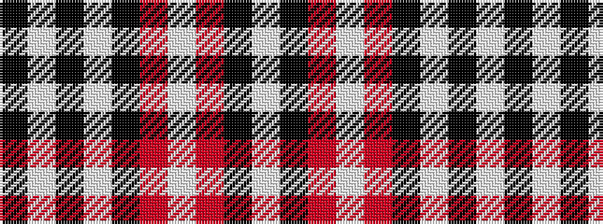

KWKWKRWRKW

It is a 10 stripe tartan.

<figure class="pat-woven">

<figcaption>idealised sample</figcaption>
</figure>

## Colour Sequence



## Tartans with this colour sequence

| Tartans |
|---------------|
| [Lebrun](/setts/s10/w40k11o8w2o8k6w2k16w1k16~x2/)|
||
