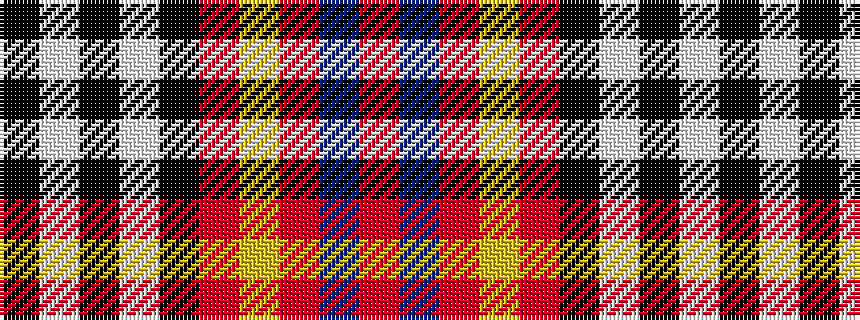

KWKWKRYRBR

It is a 10 stripe tartan.

<figure class="pat-woven">

<figcaption>idealised sample</figcaption>
</figure>

## Colour Sequence



## Tartans with this colour sequence

| Tartans |
|---------------|
| [Regimbal, Leonel–Jean (Personal)](/variants/s10/r16t1r1ly1r4k18w1k1w1k1~x4/)|
||
