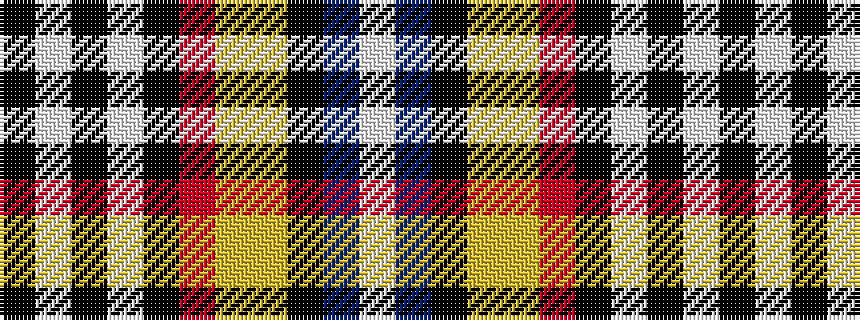

KWKWKRYYKBW

It is a 11 stripe tartan.

<figure class="pat-woven">

<figcaption>idealised sample</figcaption>
</figure>

## Colour Sequence



## Tartans with this colour sequence

| Tartans |
|---------------|
| [Zimbabwe](/setts/s11/k16w4k2w4k2r8ly8lg8k1b24w6~x2/)|
||
