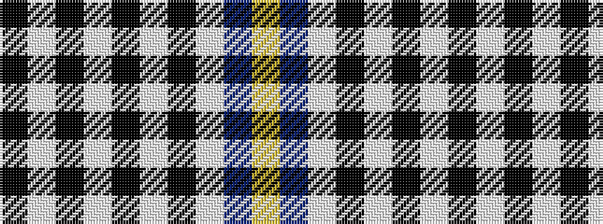

KWKWKWKWBY

It is a 10 stripe tartan.

<figure class="pat-woven">

<figcaption>idealised sample</figcaption>
</figure>

## Colour Sequence



## Tartans with this colour sequence

| Tartans |
|---------------|
| [Hannay](/setts/s10/k9w4k2w4k2w29k9w4b14lo2~x2/)|
||
| [Hannay](/setts/s10/k9w4k2w4k2w30k9w4db14ly2~x2/)|
||
| [Hannay (Clan)](/setts/s10/k9lb4k2lb4k2lb30k9lb4b14lo2~x2/)|
||
