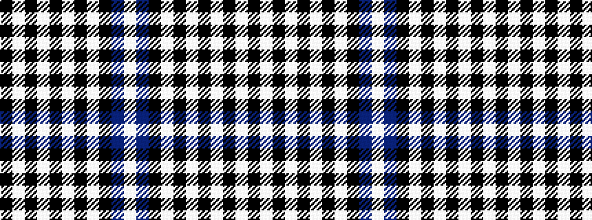

KWKWKWKWKBW

It is a 11 stripe tartan.

<figure class="pat-woven">

<figcaption>idealised sample</figcaption>
</figure>

## Colour Sequence



## Tartans with this colour sequence

| Tartans |
|---------------|
| [Napier](/tartans/k4w2k2w2k2w4k2w2k4db12w1/)|
||
| [Napier](/setts/s11/k2lb2k2lb2k2lb4k2lb2k4db12lb1~x2/)|
||
