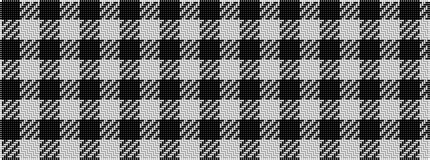

KWKWKWKWKW

It is a 10 stripe tartan.

<figure class="pat-woven">

<figcaption>idealised sample</figcaption>
</figure>

## Colour Sequence



## Tartans with this colour sequence

| Tartans |
|---------------|
| [Kinloch Anderson Black and White](/setts/s10/k4w14k2w4k8w3k30w2k4w4~x2/)|
||
