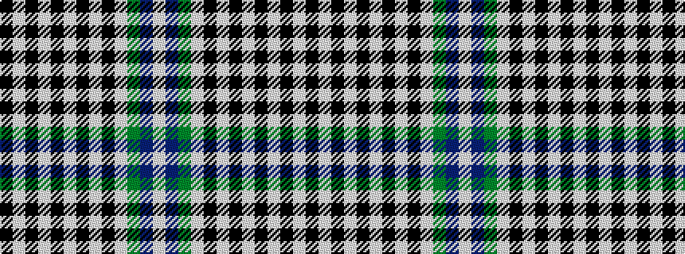

KWKWKWKWKWGBW

It is a 13 stripe tartan.

<figure class="pat-woven">

<figcaption>idealised sample</figcaption>
</figure>

## Colour Sequence



## Tartans with this colour sequence

| Tartans |
|---------------|
| [IAPD](/variants/s13/k8w7k2w3k2w3k2w3k2w7g18p27w3~x2/)|
||
