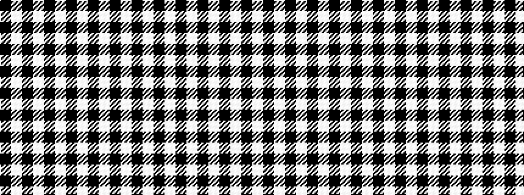

KWKWKWKWKWK

It is a 11 stripe tartan.

<figure class="pat-woven">

<figcaption>idealised sample</figcaption>
</figure>

## Colour Sequence



## Tartans with this colour sequence

| Tartans |
|---------------|
| [Royal Stewart B & W (Universal?)](/variants/s11/k36w4k6w1k1w1k1w8k4w1k6~x2/)|
||
