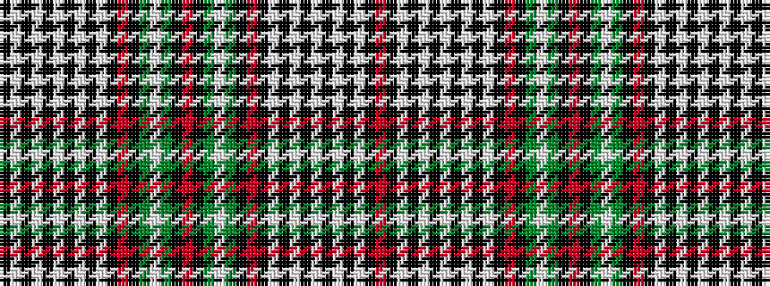

KWKWKWKWKWKRKGWGKRKGWGKRKWKWKWKWKWKR

It is a 36 stripe tartan.

<figure class="pat-woven">

<figcaption>idealised sample</figcaption>
</figure>

## Colour Sequence



## Tartans with this colour sequence

| Tartans |
|---------------|
| [Southwick](/setts/s36/r2k12g2w5g2k2r2k5lb10k2lb4k2lb4k2lb4k10w2k1r2~x2/)|
||
