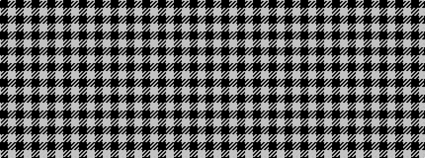

KWKWKWKWKWKW

It is a 12 stripe tartan.

<figure class="pat-woven">

<figcaption>idealised sample</figcaption>
</figure>

## Colour Sequence



## Tartans with this colour sequence

| Tartans |
|---------------|
| [Scott](/variants/s12/k31w2k4w1k1w1k1w1k1w1k3w3~x4/)|
||
| [Stuart/Stewart Mourning](/variants/s12/k43w4k6w2k3w2k3w9k5w3k3w3~x2/)|
||
