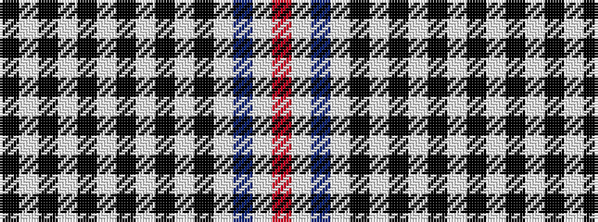

KWKWKWKWKWKWBWR

It is a 15 stripe tartan.

<figure class="pat-woven">

<figcaption>idealised sample</figcaption>
</figure>

## Colour Sequence



## Tartans with this colour sequence

| Tartans |
|---------------|
| [Scott, Sir Walter](/setts/s15/k3w7k7w7k7w7k7w7k7w7k7w7db5w3r3~x2/)|
||
