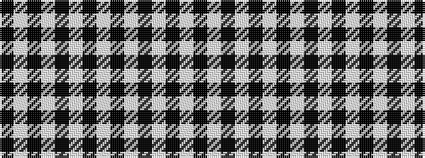

KWKWKWKWKWKWKW

It is a 14 stripe tartan.

<figure class="pat-woven">

<figcaption>idealised sample</figcaption>
</figure>

## Colour Sequence



## Tartans with this colour sequence

| Tartans |
|---------------|
| [Heolbellva ha Materi (Fashion)](/variants/s14/w91k1w6k2w5k3w4k4w3k5w2k6w1k7~x2/)|
||
