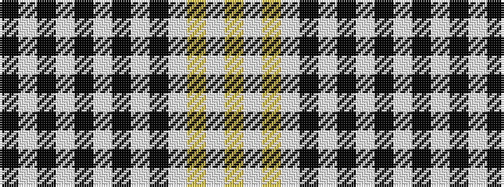

KWKWKWKWKWYWY

It is a 13 stripe tartan.

<figure class="pat-woven">

<figcaption>idealised sample</figcaption>
</figure>

## Colour Sequence



## Tartans with this colour sequence

| Tartans |
|---------------|
| [Thain, dress](/tartans/ly22w1ly2w2k2w1k14w1k2w2k2w1k14/)|
||
