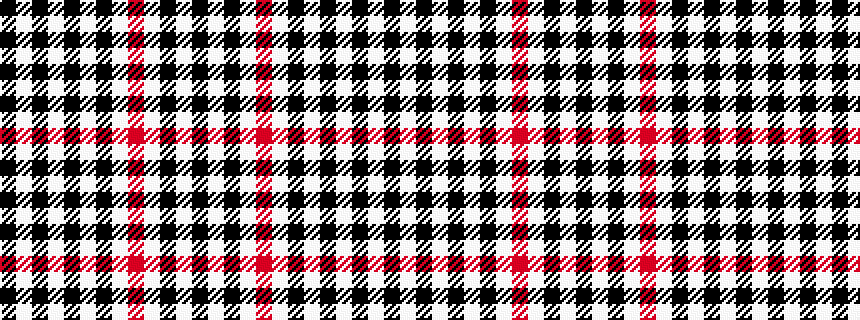

KWKWKWKWRWKWK

It is a 13 stripe tartan.

<figure class="pat-woven">

<figcaption>idealised sample</figcaption>
</figure>

## Colour Sequence



## Tartans with this colour sequence

| Tartans |
|---------------|
| [Blackcraig (Personal)](/variants/s13/k10w10k10w10r3w6k3w3k3w3k3w3k3~x2/)|
||
