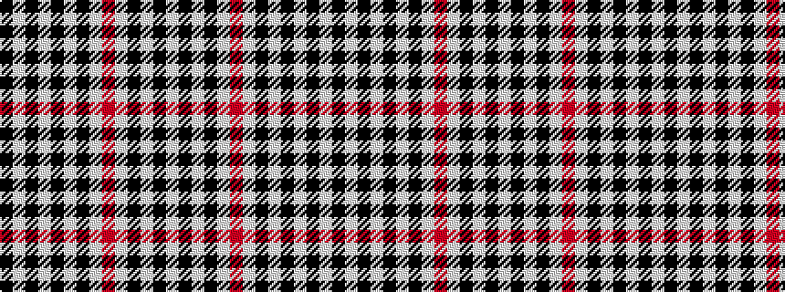

KWKWKWKWRWKWKW

It is a 14 stripe tartan.

<figure class="pat-woven">

<figcaption>idealised sample</figcaption>
</figure>

## Colour Sequence



## Tartans with this colour sequence

| Tartans |
|---------------|
| [Pars, Dress (Sports)](/variants/s14/w10k1w5k7w7r2w7k50w7k2w7k7w5k1~x2/)|
||
