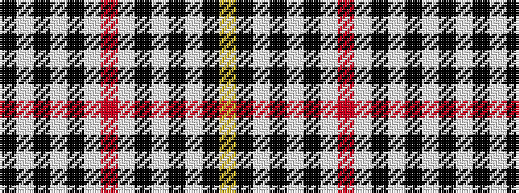

KWKWKWRWKWKWKY

It is a 14 stripe tartan.

<figure class="pat-woven">

<figcaption>idealised sample</figcaption>
</figure>

## Colour Sequence



## Tartans with this colour sequence

| Tartans |
|---------------|
| [Summer Spirit](/setts/s14/r2w2k2w28k8w9k1ly2~x2/)|
||
