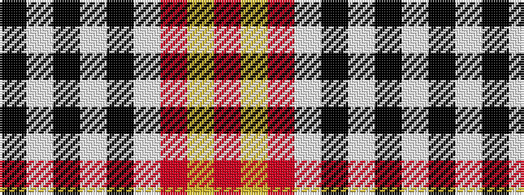

KWKWKWRYR

It is a 9 stripe tartan.

<figure class="pat-woven">

<figcaption>idealised sample</figcaption>
</figure>

## Colour Sequence



## Tartans with this colour sequence

| Tartans |
|---------------|
| [Falkirk (District)](/variants/s9/k4lb4k2lb4k2lb22o27ly2r3~x2/)|
||
