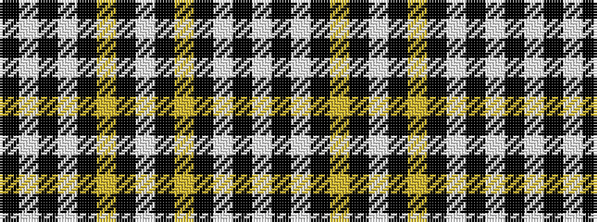

KWKWKYKWKYKWKW

It is a 14 stripe tartan.

<figure class="pat-woven">

<figcaption>idealised sample</figcaption>
</figure>

## Colour Sequence



## Tartans with this colour sequence

| Tartans |
|---------------|
| [Unidentified Plaid #6](/variants/s14/w100k15w2k4ly2k6w10k4ly2k13w4k100w3k2/)|
||
