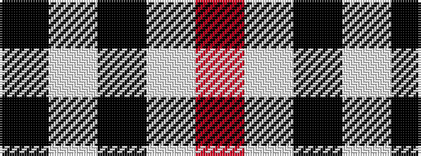

KWKWR

It is a 5 stripe tartan.

<figure class="pat-woven">

<figcaption>idealised sample</figcaption>
</figure>

## Colour Sequence



## Tartans with this colour sequence

| Tartans |
|---------------|
| [Daks - House Check, C.6700.03](/variants/s5/k3w7k4w6o3~x2/)|
||
| [McPartlin (Personal)](/variants/s5/k27w29k5w14r2~x2/)|
||
