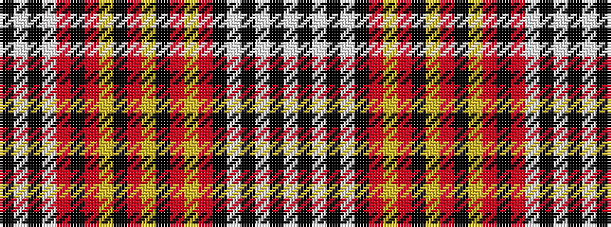

KWKWRKRYKRYKRYRKWKWKW

It is a 21 stripe tartan.

<figure class="pat-woven">

<figcaption>idealised sample</figcaption>
</figure>

## Colour Sequence



## Tartans with this colour sequence

| Tartans |
|---------------|
| [Clutha](/variants/s21/w6k4w3k3w2k18o1ly5o1k3ly2o1k3ly2o1k32o2w6k3w6k3~x2/)|
||
