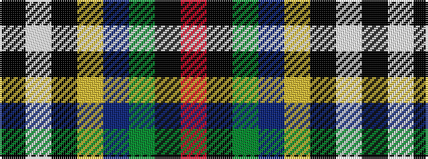

KWKYBGKR

It is a 8 stripe tartan.

<figure class="pat-woven">

<figcaption>idealised sample</figcaption>
</figure>

## Colour Sequence



## Tartans with this colour sequence

| Tartans |
|---------------|
| [Froben, Christian (Personal)](/variants/s8/k2w2k8ly8db24g13k3r1~x2/)|
||
| [Froben, Christian (Personal)](/variants/s8/k2w2k8lo8db24dg13k3m1~x2/)|
||
