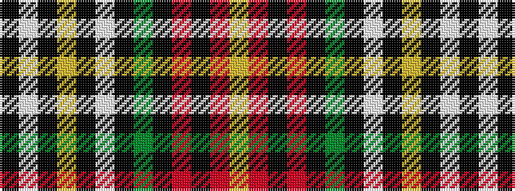

KWKYKWKGKRKRY

It is a 13 stripe tartan.

<figure class="pat-woven">

<figcaption>idealised sample</figcaption>
</figure>

## Colour Sequence



## Tartans with this colour sequence

| Tartans |
|---------------|
| [BeeJay](/variants/s13/k1lb8k1lo1k1w8k1g8k1r1k1r8lo1~x4/)|
||
