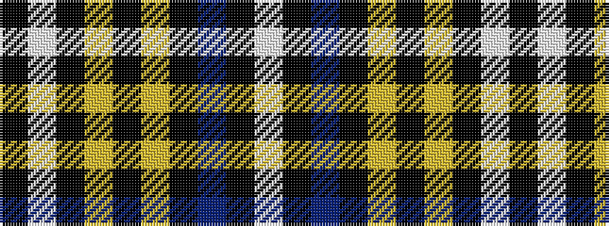

KWKYKYKBKW

It is a 10 stripe tartan.

<figure class="pat-woven">

<figcaption>idealised sample</figcaption>
</figure>

## Colour Sequence



## Tartans with this colour sequence

| Tartans |
|---------------|
| [Newcastle](/setts/s10/w8k1db2k4ly2k2ly2k24w8k2~x2/)|
||
