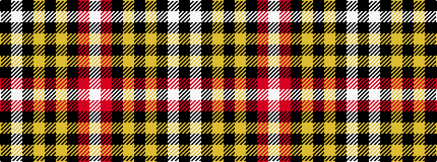

KWKYKYKRW

It is a 9 stripe tartan.

<figure class="pat-woven">

<figcaption>idealised sample</figcaption>
</figure>

## Colour Sequence



## Tartans with this colour sequence

| Tartans |
|---------------|
| [Buchanan Old Dress](/variants/s9/k40w25k10ly8k3ly8k10r25w4~x2/)|
||
| [Lord Laird](/variants/s9/k4w26k10lo8k3lo8k10r26w4~x2/)|
||
