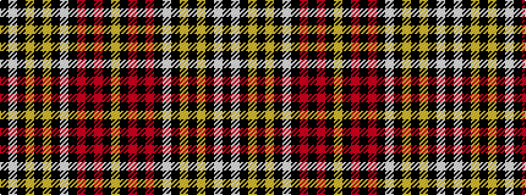

KWKYKYKWKRKRKY

It is a 14 stripe tartan.

<figure class="pat-woven">

<figcaption>idealised sample</figcaption>
</figure>

## Colour Sequence



## Tartans with this colour sequence

| Tartans |
|---------------|
| [Largs Dress (1972)](/variants/s14/k54lb2k2lo9k2lo9k1lb2k9r8k2r8k4lo2~x2/)|
||
