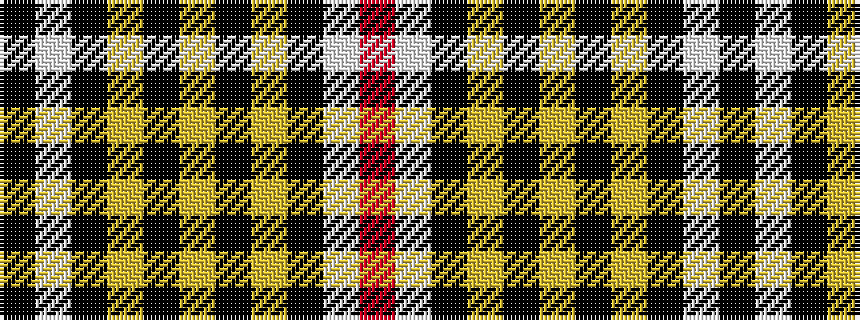

KWKYKYKYKWR

It is a 11 stripe tartan.

<figure class="pat-woven">

<figcaption>idealised sample</figcaption>
</figure>

## Colour Sequence



## Tartans with this colour sequence

| Tartans |
|---------------|
| [Bartlett from El Paso, Texas](/variants/s11/r3w2k2lo1k39lo1k1ly2k1wi15k1~x2/)|
||
