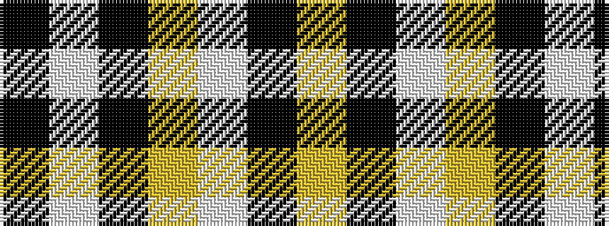

KWKYWKY

It is a 7 stripe tartan.

<figure class="pat-woven">

<figcaption>idealised sample</figcaption>
</figure>

## Colour Sequence



## Tartans with this colour sequence

| Tartans |
|---------------|
| [Kernow Spirit (Corporate)](/setts/s7/k14w4k8ly45w3k1ly2~x2/)|
||
