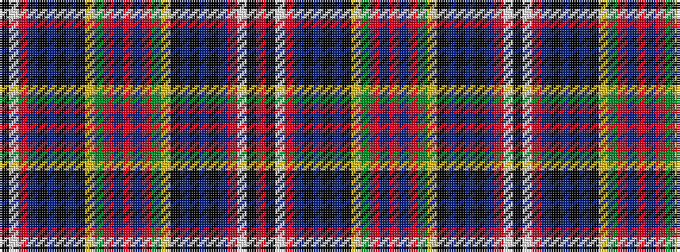

KWRBKBKBKYGRBRBRGYKBKBKBRWKR

It is a 28 stripe tartan.

<figure class="pat-woven">

<figcaption>idealised sample</figcaption>
</figure>

## Colour Sequence



## Tartans with this colour sequence

| Tartans |
|---------------|
| [Wilson's No.043](/setts/s28/k5w4r19t12k2t2k2t12k20ly3g26r19t5r20t5r19g26ly3k20t12k2t2k2t12r19w4k5r5~x2/)|
||
