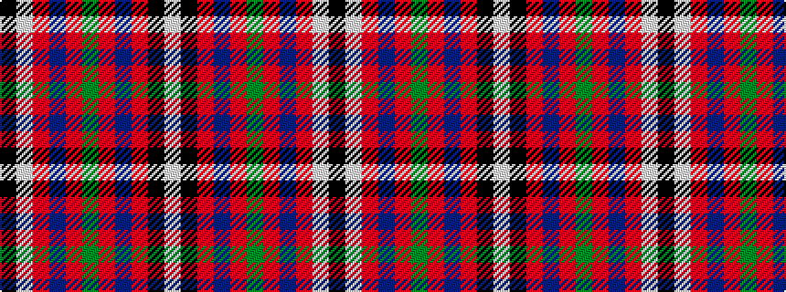

KWRBRGRBRKW

It is a 11 stripe tartan.

<figure class="pat-woven">

<figcaption>idealised sample</figcaption>
</figure>

## Colour Sequence



## Tartans with this colour sequence

| Tartans |
|---------------|
| [Hoben (Personal)](/variants/s11/k3w1r20db4r4g10r4db4r20k1w3~x2/)|
||
